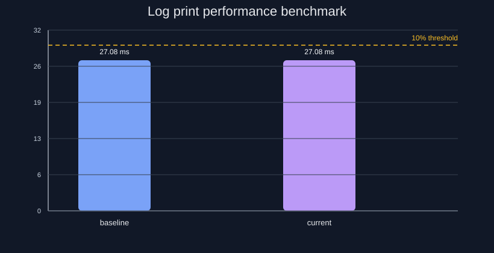

# Equinox logging engine 2.1
**Thread safety C++ logger version 2.1**

**Logger with support logging to file, console or both. Six levels available:**
- Trace 
- Debug
- Info
- Warning
- Error
- Critical
- Off

## Features

- settable log level
- settable output direction (console, file or both)
- configured build to shared/static lib

## Building for source
```sh
cmake CMakeLists.txt
make
```
## Install
```sh
$ sudo make install (Ubuntu)
or
# make install
```
## Example:

Include "EquinoxLogger.hpp" to your source code:
```sh
See: examples/src/EquinoxLoggerExamples.cpp
```
```sh
#include "EquinoxLogger.hpp"

int main(void) {

  equinox::setup(equinox::level::LOG_LEVEL::trace,
                 std::string("equinox-test"),
                 equinox::logs_output::SINK::console_and_file,
                 std::string("equinox.log"),
                 3U * 1024U * 1024U,
                 5U);

  equinox::trace(   "Example trace log no:    [%d]" , 1);
  equinox::debug(   "Example debug log no:    [%d]" , 2);
  equinox::info(    "Example info log no:     [%d]" , 3);
  equinox::warning( "Example warning log no:  [%d]" , 4);
  equinox::error(   "Example error log no:    [%d]" , 5);
  equinox::critical("Example critical log no: [%d]" , 6);

  return 0;
}

Output:
 
[Mon Apr  3 15:43:39 2023][1680529419785][equinox-test][TRACE] Example trace log no:    [1]
[Mon Apr  3 15:43:39 2023][1680529419787][equinox-test][DEBUG] Example debug log no:    [2]
[Mon Apr  3 15:43:39 2023][1680529419787][equinox-test][INFO] Example info log no:     [3]
[Mon Apr  3 15:43:39 2023][1680529419788][equinox-test][WARNING] Example warning log no:  [4]
[Mon Apr  3 15:43:39 2023][1680529419788][equinox-test][ERROR] Example error log no:    [5]
[Mon Apr  3 15:43:39 2023][1680529419788][equinox-test][CRITICAL] Example critical log no: [6]

```

### Colored logs preview (GitHub-friendly)

GitHub README does not render terminal ANSI colors inside code blocks, so this preview uses colored badges for each level:

-  `[Mon Apr 3 15:43:39 2023][1680529419785][equinox-test][TRACE] Example trace log no: [1]`
-  `[Mon Apr 3 15:43:39 2023][1680529419787][equinox-test][DEBUG] Example debug log no: [2]`
-  `[Mon Apr 3 15:43:39 2023][1680529419787][equinox-test][INFO] Example info log no: [3]`
-  `[Mon Apr 3 15:43:39 2023][1680529419788][equinox-test][WARNING] Example warning log no: [4]`
-  `[Mon Apr 3 15:43:39 2023][1680529419788][equinox-test][ERROR] Example error log no: [5]`
-  `[Mon Apr 3 15:43:39 2023][1680529419788][equinox-test][CRITICAL] Example critical log no: [6]`

## Performance benchmark

The repository runs a log-print throughput benchmark on every PR targeting `main`.

What is measured:
- the benchmark executes a fixed number of log writes through the public logging API
- it measures the wall-clock time for the whole sequence using `std::chrono::steady_clock`
- it reports the result as milliseconds per run and stores it in the benchmark history file
- the generated chart compares the current result to the baseline and shows the 10% slowdown threshold

The exact benchmark test looks like this:
```cpp
TEST(PerformanceBenchmark, LogPrintThroughput) {
    std::filesystem::remove(kBenchmarkLogPath);

    ASSERT_TRUE(equinox::setup(equinox::level::LOG_LEVEL::info,
                               "PerformanceBenchmark",
                               equinox::logs_output::SINK::file,
                               kBenchmarkLogPath,
                               32U * 1024U * 1024U,
                               2U));

    const auto start = std::chrono::steady_clock::now();

    for (int i = 0; i < kBenchmarkIterations; ++i) {
        equinox::info("benchmark message %d | value=%d | tag=%s", i, i * 11, "perf");
    }

    equinox::flush();

    const auto end = std::chrono::steady_clock::now();
    const auto elapsed_ms = std::chrono::duration<double, std::milli>(end - start).count();

    std::cout << "BENCHMARK_RESULT: {\"test\":\"LogPrintThroughput\",\"iterations\":"
              << kBenchmarkIterations
              << ",\"elapsed_ms\":" << elapsed_ms << "}" << std::endl;

    EXPECT_GT(elapsed_ms, 0.0);
}
```

This test prints the measured time as a JSON-like result, which is then consumed by the CI script to compare with the baseline and enforce the 10% threshold.

Failure rule:
- the benchmark is considered failed when the current runtime is slower than the baseline by more than 10%
- the rule is enforced in CI and the check exits non-zero if the slowdown exceeds the threshold

The benchmark is implemented in the `PerformanceBenchmark.LogPrintThroughput` GoogleTest and the chart is generated by `scripts/performance_benchmark.py`.



To generate the chart locally:
```sh
./scripts/run_performance_benchmark.sh \
  --binary build/Debug/tests/EquinoxLoggerTests.x86 \
  --output-dir docs/images \
  --history-file benchmarks/performance-history.json \
  --threshold 10
```

The output is saved to `docs/images/performance-benchmark.svg` and the benchmark history is stored in `benchmarks/performance-history.json`.

## Unit Test Coverage

Coverage measured with [LCOV](https://github.com/linux-test-project/lcov) on 2026-05-01:

| Metric             | Rate   | Total | Hit |
|--------------------|--------|-------|-----|
| Lines              | 96.2 % | 417   | 401 |
| Functions          | 92.3 % | 104   | 96  |


To regenerate the report:
```sh
./scripts/coverage.sh -o
```

## Log rotation

- When the log file reaches the configured max size, the current log is renamed to a rotated file and a new file is created.
- Rotated files use the scheme logs_1.log, logs_2.log, ... up to the configured max number of files, then wrap around.
- Rotation is enabled when both max size and max files are greater than 0.

## License
**BSD 3-Clause License**
<br/>Copylefts (c) 2026, Janusz Wolak
<br/>All rights not reserved.
