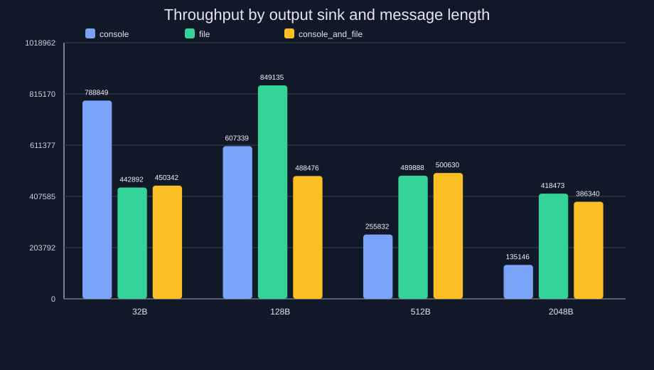

# Equinox logging engine 2.1.48

**Logger with support logging to file, console or both. Six levels available:**
- Trace 
- Debug
- Info
- Warning
- Error
- Critical
- Off

## Table of contents

- [Features](#features)
- [Building for source](#building-for-source)
- [Install](#install)
- [Logging macros and `NDEBUG`](#logging-macros-and-ndebug)
- [Example](#example)
- [Colored logs preview](#colored-logs-preview-github-friendly)
- [Performance benchmark](#performance-benchmark)
- [Unit Test Coverage](#unit-test-coverage)

## Features

- settable log level
- settable output direction (console, file or both)
- configured build to shared/static lib

## Building for source
```sh
cmake CMakeLists.txt
make
```

[Back to table of contents](#table-of-contents)

## Install
```sh
$ sudo make install (Ubuntu)
or
# make install
```

[Back to table of contents](#table-of-contents)

## Logging macros and `NDEBUG`

The project also provides convenience macros in `EquinoxLoggerMacros.h`:

```cpp
#include "EquinoxLoggerMacros.h"

EQUINOX_TRACE("trace message %d", 1);
EQUINOX_DEBUG("debug message %d", 2);
EQUINOX_INFO("info message %d", 3);
EQUINOX_WARNING("warning message %d", 4);
EQUINOX_ERROR("error message %d", 5);
EQUINOX_CRITICAL("critical message %d", 6);
```

The macro behavior depends on the standard `NDEBUG` flag:

- If the build is a Debug configuration, `NDEBUG` is not defined, so `EQUINOX_TRACE(...)` and `EQUINOX_DEBUG(...)` call the normal logging API.
- If the build is a Release configuration, `NDEBUG` is typically defined by the compiler or by a build flag such as `-DNDEBUG` or the CMake Release preset, so those two macros compile to empty `do { } while (0)` statements.
- This removes the runtime cost of trace/debug formatting and evaluation in Release builds while keeping higher-priority logs available according to the configured logger level.

In other words, `trace` and `debug` are stripped out before formatting when `NDEBUG` is active, which gives a zero-cost path for these two levels in Release builds.

[Back to table of contents](#table-of-contents)

## Example:

Include "EquinoxLogger.hpp" to your source code:
```sh
See: examples/src/EquinoxLoggerExamples.cpp
```
```cpp
#include <iostream>

#include "EquinoxLogger.hpp"

int main(void) {
    equinox::setup(equinox::level::LOG_LEVEL::trace, std::string("equinox-test"), equinox::logs_output::SINK::console_and_file, std::string("equinox.log"),
                   3U * 1024U * 1024U, 5U);

    equinox::trace("Example trace log no:    [%d]", 1);
    equinox::debug("Example debug log no:    [%d]", 2);
    equinox::info("Example info log no:     [%d]", 3);
    equinox::warning("Example warning log no:  [%d]", 4);
    equinox::error("Example error log no:    [%d]", 5);
    equinox::critical("Example critical log no: [%d]", 6);

    EQUINOX_TRACE("Example MACRO trace log no:    [%d]", 1);
    EQUINOX_DEBUG("Example MACRO debug log no:    [%d]", 2);
    EQUINOX_INFO("Example MACRO info log no:     [%d]", 3);
    EQUINOX_WARNING("Example MACRO warning log no:  [%d]", 4);
    EQUINOX_ERROR("Example MACRO error log no:    [%d]", 5);
    EQUINOX_CRITICAL("Example MACRO critical log no: [%d]", 6);

    return 0;
}
```
```
Output:
 
[Wed Aug 19 16:04:22 2026][1787148262892][equinox-test][TRACE] Example trace log no:    [1]
[Wed Aug 19 16:04:22 2026][1787148262893][equinox-test][DEBUG] Example debug log no:    [2]
[Wed Aug 19 16:04:22 2026][1787148262893][equinox-test][INFO] Example info log no:     [3]
[Wed Aug 19 16:04:22 2026][1787148262893][equinox-test][WARNING] Example warning log no:  [4]
[Wed Aug 19 16:04:22 2026][1787148262893][equinox-test][ERROR] Example error log no:    [5]
[Wed Aug 19 16:04:22 2026][1787148262893][equinox-test][CRITICAL] Example critical log no: [6]

[Wed Aug 19 16:04:22 2026][1787148262893][equinox-test][TRACE] Example MACRO trace log no:    [1]
[Wed Aug 19 16:04:22 2026][1787148262893][equinox-test][DEBUG] Example MACRO debug log no:    [2]
[Wed Aug 19 16:04:22 2026][1787148262893][equinox-test][INFO] Example MACRO info log no:     [3]
[Wed Aug 19 16:04:22 2026][1787148262893][equinox-test][WARNING] Example MACRO warning log no:  [4]
[Wed Aug 19 16:04:22 2026][1787148262893][equinox-test][ERROR] Example MACRO error log no:    [5]
[Wed Aug 19 16:04:22 2026][1787148262893][equinox-test][CRITICAL] Example MACRO critical log no: [6]

```

[Back to table of contents](#table-of-contents)

GitHub README does not render terminal ANSI colors inside code blocks, so this preview uses colored badges for each level:

-  `[Mon Apr 3 15:43:39 2023][1680529419785][equinox-test][TRACE] Example trace log no: [1]`
-  `[Mon Apr 3 15:43:39 2023][1680529419787][equinox-test][DEBUG] Example debug log no: [2]`
-  `[Mon Apr 3 15:43:39 2023][1680529419787][equinox-test][INFO] Example info log no: [3]`
-  `[Mon Apr 3 15:43:39 2023][1680529419788][equinox-test][WARNING] Example warning log no: [4]`
-  `[Mon Apr 3 15:43:39 2023][1680529419788][equinox-test][ERROR] Example error log no: [5]`
-  `[Mon Apr 3 15:43:39 2023][1680529419788][equinox-test][CRITICAL] Example critical log no: [6]`

[Back to table of contents](#table-of-contents)

## Performance benchmark

The repository runs a log-print throughput benchmark on every PR targeting `main`.

The benchmark is split by build type for comparison. The Release benchmark keeps a 10% regression guard, and the Debug benchmark is evaluated with the same baseline comparison policy without an extra percentage cushion.

This keeps the policy consistent with the measured behavior in the project, where the absolute timing of `Debug` and `Release` can vary and should not be treated as a fixed rule based only on optimization level.

What is measured:
- the benchmark executes a fixed number of log writes through the public logging API
- it measures the wall-clock time for the whole sequence using `std::chrono::steady_clock`
- it reports the result as milliseconds per run and stores it in the benchmark history file
- the generated chart compares the current result to the baseline and shows the 10% slowdown threshold

The exact benchmark test looks like this:
```cpp
TEST(PerformanceBenchmark, LogPrintThroughput) {
    std::filesystem::remove(kBenchmarkLogPath);

    ASSERT_TRUE(equinox::setup(equinox::level::LOG_LEVEL::info,
                               "PerformanceBenchmark",
                               equinox::logs_output::SINK::file,
                               kBenchmarkLogPath,
                               32U * 1024U * 1024U,
                               2U));

    const auto start = std::chrono::steady_clock::now();

    for (int i = 0; i < kBenchmarkIterations; ++i) {
        equinox::info("benchmark message %d | value=%d | tag=%s", i, i * 11, "perf");
    }

    equinox::flush();

    const auto end = std::chrono::steady_clock::now();
    const auto elapsed_ms = std::chrono::duration<double, std::milli>(end - start).count();

    std::cout << "BENCHMARK_RESULT: {\"test\":\"LogPrintThroughput\",\"iterations\":"
              << kBenchmarkIterations
              << ",\"elapsed_ms\":" << elapsed_ms << "}" << std::endl;

    EXPECT_GT(elapsed_ms, 0.0);
}
```

This test prints the measured time as a JSON-like result, which is then consumed by the CI script to compare with the baseline and enforce the configured threshold for that build type.

Failure rule:
- the Release benchmark fails when the current runtime is slower than the baseline by more than 10%
- the Debug benchmark follows the same comparison rule without a separate threshold modifier
- the rule is enforced in CI and the check exits non-zero if the slowdown exceeds the threshold

The benchmark is implemented in the `PerformanceBenchmark.LogPrintThroughput` GoogleTest and the chart is generated by `scripts/performance_benchmark.py`.

### Release benchmark (main chart)
Measured on the Release build. Threshold: 10%.

The latest Release benchmark is published from GitHub Pages and refreshed on each successful main-branch CI run, without committing generated images to the repository.

Live benchmark dashboard: https://jwolak.github.io/Equinox/

> This chart is regenerated only after a successful merge into `main`. Pull request runs validate the benchmark and threshold checks, but they do not publish the main Pages site.


> This image reflects the latest successful build from the main branch. PR runs do not deploy the Pages site; they only validate the benchmark and test jobs.

### Debug benchmark (additional comparison)
Measured on the Debug build using the same baseline comparison rule as the Release benchmark.


> The benchmark charts are published as temporary CI artifacts and also deployed to the GitHub Pages site for the latest successful build.
>
> - `performance-benchmark-Release.svg`
> - `performance-throughput-by-sink-Release.svg`
> - `performance-benchmark-Debug.svg`
> - `performance-throughput-by-sink-Debug.svg`

To generate the charts locally:
```sh
./scripts/run_performance_benchmark.sh \
  --binary build/Debug/tests/EquinoxLoggerTests.x86 \
  --output-dir docs/images \
  --chart-name performance-benchmark-Release.svg \
  --sink-chart-name performance-throughput-by-sink-Release.svg \
  --history-file benchmarks/performance-history-Release.json \
  --threshold 10 \
  --build-label "Release"

./scripts/run_performance_benchmark.sh \
  --binary build/Debug/tests/EquinoxLoggerTests.x86 \
  --output-dir docs/images \
  --chart-name performance-benchmark-Debug.svg \
  --sink-chart-name performance-throughput-by-sink-Debug.svg \
  --history-file benchmarks/performance-history-Debug.json \
  --threshold 10 \
  --build-label "Debug"
```

The output is saved separately for each build type, with Release used as the primary benchmark shown in the main README and Debug kept as an additional comparison chart.

### Throughput by message length and sink

The project also includes a second benchmark that measures how many log entries per second can be processed for different message sizes and output sinks.

For each combination of message length and sink (`console`, `file`, `console_and_file`) the test records the throughput in logs/sec and renders a grouped chart.

In CI, the noisy `console` and `console_and_file` variants are intentionally skipped to keep the job logs readable and to avoid flooding GitHub Actions output. The published CI chart therefore focuses on the `file` sink for the automated regression run, while the full local benchmark still includes all sink variants.

Both benchmark charts are published as CI artifacts for every PR, so the throughput-by-sink result is kept alongside the main regression chart.



To generate this chart locally:
```sh
./scripts/run_performance_benchmark.sh \
  --binary build/Debug/tests/EquinoxLoggerTests.x86 \
  --output-dir docs/images \
  --chart-name performance-throughput-by-sink.svg \
  --threshold 10
```

This benchmark is useful for understanding how output destination and log message size affect throughput in real workloads.

### CI benchmark policy

The benchmark suite is intentionally a bit different in CI than on a developer machine.

- full sink-by-length throughput benchmarks are kept for local validation
- in GitHub Actions, the noisy `console` and `console_and_file` variants are skipped to avoid flooding the job logs
- CI still runs a compact `file`-sink throughput check to preserve meaningful regression coverage without causing log spam

This keeps the PR checks readable while still measuring the most important performance path under automation.

[Back to table of contents](#table-of-contents)

## Unit Test Coverage

Coverage measured with [LCOV](https://github.com/linux-test-project/lcov) on 2026-05-01:

| Metric             | Rate   | Total | Hit |
|--------------------|--------|-------|-----|
| Lines              | 96.2 % | 417   | 401 |
| Functions          | 92.3 % | 104   | 96  |


To regenerate the report:

[Back to table of contents](#table-of-contents)
```sh
./scripts/coverage.sh -o
```

## Log rotation

- When the log file reaches the configured max size, the current log is renamed to a rotated file and a new file is created.
- Rotated files use the scheme logs_1.log, logs_2.log, ... up to the configured max number of files, then wrap around.
- Rotation is enabled when both max size and max files are greater than 0.

## License
**BSD 3-Clause License**
<br/>Copylefts (c) 2026, Janusz Wolak
<br/>All rights not reserved.
